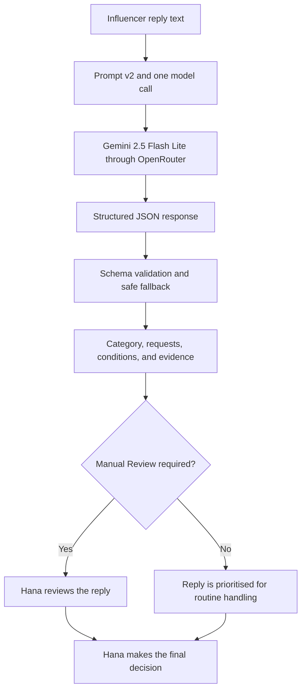

# Influencer Reply Triage for Cosmetics Marketing Teams

PE6201 End-of-Course Project  
Individual project by Seungmin Yoo

## Project overview

This project is a small AI-assisted triage system for cosmetics influencer campaign replies. It helps a campaign manager review incoming messages by:

- assigning one of five categories;
- extracting the influencer's requests and important conditions; and
- flagging uncertain or sensitive cases for **Manual Review**.

The system supports prioritisation only. It does not approve partnerships, make contractual decisions, or send replies automatically. Final decisions remain with the campaign manager.

## Product documentation

| Item | Description |
|---|---|
| **Persona** | Hana, a cosmetics campaign manager reviewing influencer replies for a campaign. |
| **Input** | One influencer reply as plain text. Only `reply_text` is sent to the classification model. |
| **Output** | A structured JSON result containing category, requests, important conditions, evidence, `manual_review`, and `manual_review_reason`. |
| **Human decision** | Hana reviews escalated cases and remains responsible for every collaboration, negotiation, and messaging decision. |

### High-level architecture

The LLM provides external language intelligence. The project code supplies the prompt, category rules, structured-output validation, fallback behaviour, metric calculation, and Manual Review logic.

## Business problem

A campaign manager such as **Hana** may need to review 50 influencer replies for a single campaign, each with different intentions, questions, and conditions. Reading and organising every reply manually is slow, while relying only on keywords can miss meaning that is implied or placed late in a message. Existing platforms such as Upfluence support influencer outreach and status management; this project instead focuses on a small, explainable reply-triage tool for cosmetics teams. A particularly important risk is an apparently positive reply that contains a hidden condition, such as exclusivity, timing, payment, or product restrictions.

The MVP aims to reduce the initial reading workload while preserving human oversight for ambiguous and higher-risk cases.

## System workflow

1. The user provides one influencer reply.
2. One call is made to `google/gemini-2.5-flash-lite` through OpenRouter.
3. The model returns structured JSON.
4. Output validation and fallback rules check the response.
5. Cases requiring judgment are sent to Manual Review.

No RAG or multi-step agent is used. A one-call prompt was selected as the smallest working version because it is simple, fast, inexpensive, and appropriate for the short-message classification and extraction task.

## Output categories

| Category | Meaning |
|---|---|
| `Interested` | The influencer clearly wants to participate without a material condition requiring negotiation. |
| `Declined` | The influencer clearly refuses or cannot participate. |
| `Needs Information` | The influencer mainly asks for information before deciding. |
| `Negotiation` | The reply contains a material condition or proposed change, such as payment, exclusivity, timing, deliverables, or product restrictions. |
| `Unclear` | The intention is ambiguous, conflicting, or cannot be classified safely. |

The JSON output also includes extracted requests, important conditions, evidence, `manual_review`, and a reason for escalation.

## Manual Review and safety

Manual Review acts as the system's abstention and escalation mechanism. It is triggered for `Negotiation` and `Unclear` cases, hidden or material conditions, conflicting intent, and invalid or unsafe model output.

This design deliberately trades some automation for safety: the system may send more messages to a person, but it should avoid confidently processing a risky reply without review.

## Data and evaluation design

- **Development set:** 60 synthetic replies generated with ChatGPT, balanced across the five categories, then manually reviewed and labelled.
- **Held-out set:** 40 independently generated replies created with Claude, then manually reviewed and labelled before final testing.
- The generation prompts were saved for transparency and reproducibility.
- The development set was used for prompt improvement.
- The held-out set was evaluated once after Prompt v2 was frozen.

Using a different model to generate the held-out set reduced the risk of evaluating only on phrasing similar to the development data. The data are still synthetic, so performance on real campaign messages may differ.

## Model and prompt development

The project compared the LLM system with two simple baselines:

- a majority-class baseline; and
- a keyword-rule baseline.

Prompt v1 established the initial five-class rules and structured output. Development errors were reviewed, and Prompt v2 clarified category boundaries, hidden conditions, conflicting intent, and Manual Review requirements. No held-out cases were used to revise the final prompt.

## Target metrics

The targets reflect the initial classification goal and the safety requirements of the problem statement. Cost and latency were measured as operational metrics rather than given artificial thresholds after the run.

| Metric | Target | Final result | Status |
|---|---:|---:|---|
| Held-out category accuracy | At least 80% | **95.0%** | Met |
| Hidden-condition cases sent to Manual Review | 100% | **7/7 (100%)** | Met |
| Valid structured JSON | 100% | **39/40 (97.5%)** | Not fully met |
| Human decision authority | 100%; no autonomous messages or contract decisions | **100% by design** | Met |
| Average latency | Measured operational metric | **0.803 seconds** | Reported |
| Model cost for 50 replies | Measured operational metric | **USD 0.005530** | Reported |

## Results

### System comparison

| System | Evaluation set | Category accuracy | Manual Review accuracy |
|---|---|---:|---:|
| Majority baseline | Development (60) | 20.0% | Not measured |
| Keyword baseline | Development (60) | 68.3% | Not measured |
| Prompt v1 | Development (60) | 96.7% | 98.3% |
| Prompt v2 | Development (60) | 100.0% | 100.0% |
| Frozen Prompt v2 | Held-out (40) | **95.0%** | **97.5%** |

### Final held-out evaluation

| Metric | Result |
|---|---:|
| Correct categories | 38/40 |
| Category accuracy | **95.0%** |
| Manual Review accuracy | **97.5%** |
| Valid JSON rate | 39/40 (**97.5%**) |
| Hidden-condition cases sent to Manual Review | **7/7** |
| Replies sent to Manual Review | 15/40 (**37.5%**) |
| Category errors caught by Manual Review | 1/2 |
| Average latency | **0.803 seconds** |
| Actual model cost for 40 replies | **USD 0.004424** |
| Projected model cost for 50 replies | **USD 0.005530** |

The independent held-out accuracy is the final reported performance. The 100% result applies only to the development set used during prompt improvement.

## Failure analysis

- **H006 — Negotiation predicted as Unclear:** the category was wrong, and the response also had a JSON-format issue. The fallback still set Manual Review to `true`, so the case was escalated safely.
- **H031 — Unclear predicted as Declined:** the reply contained conflicting signals, but it was classified as a simple decline and was not escalated. This is the main silent failure found in the final test.

These cases show why category accuracy alone is insufficient and why human escalation must also be evaluated.

## Repository files

| File | Purpose |
|---|---|
| `PE6201_Influencer_Reply_Triage_MVP.ipynb` | Main Colab notebook containing the MVP, baselines, prompt versions, evaluation, cost, and latency measurement. |
| `README.md` | Project overview, results, limitations, repository guide, and running instructions. |
| `DATA.md` | Data-generation, review, schema, split, and limitation explainer. |
| `EVALUATION.md` | Evaluation procedure, metric definitions, evidence files, results, and failure-analysis explainer. |
| `dev_60.csv` | Manually reviewed 60-case development dataset. |
| `dev_60_results.csv` | Prompt v1 predictions and scored results for all 60 development cases. |
| `dev_generation_prompt.txt` | Prompt used to generate the development data. |
| `development_model_comparison.csv` | Development-set comparison of the majority baseline, keyword baseline, and Prompt v1 model. |
| `heldout_40.csv` | Manually reviewed 40-case held-out dataset. |
| `heldout_40_predictions.csv` | Raw outputs from the single final held-out run. |
| `heldout_40_results.csv` | Scored final held-out results and evaluation evidence. |
| `heldout_generation_prompt.txt` | Prompt used to generate the independent held-out data. |
| `pilot_10_results.csv` | Results from the initial 10-case pilot gate. |
| `prompt_v1_v2_comparison.csv` | Case-level comparison of Prompt v1 and Prompt v2 on the development set. |
| `prompt_v2_dev_60_results.csv` | Full Prompt v2 predictions and scored results for all 60 development cases. |
| `remaining_50_results.csv` | Results for the 50 development cases evaluated after the initial 10-case pilot. |

For detailed evidence guidance, see [DATA.md](DATA.md) and [EVALUATION.md](EVALUATION.md).

## How to run

1. Open `PE6201_Influencer_Reply_Triage_MVP.ipynb` in Google Colab using the badge above.
2. In Colab, open **Secrets** and add `OPENROUTER_API_KEY`.
3. Run the setup and MVP sections in order.
4. Enter a new influencer reply in the demo input cell and run the demo.
5. Review the returned JSON and Manual Review decision.

The final held-out evaluation has already been completed and recorded. Keep `RUN_FINAL_HELDOUT_40 = False` and do not rerun the final held-out test.

## Limitations

- Both datasets are synthetic rather than real campaign messages.
- The final evaluation contains only 40 held-out cases.
- One output failed strict JSON validation.
- One held-out case produced a silent failure without Manual Review.
- Extracted requests and conditions were inspected in examples but were not assigned a separate quantitative extraction-accuracy score.
- API availability, pricing, and model behaviour may change.
- Human review remains necessary for negotiation, ambiguous intent, and contractual conditions.

## Demo video

Demo video: [PE6201 Final Project Individual Demo Video](https://youtu.be/_XS80AxOY1Q)

## Course

PE6201 — End-of-Course Project  
MSc in Enterprise Artificial Intelligence, Nanyang Technological University
